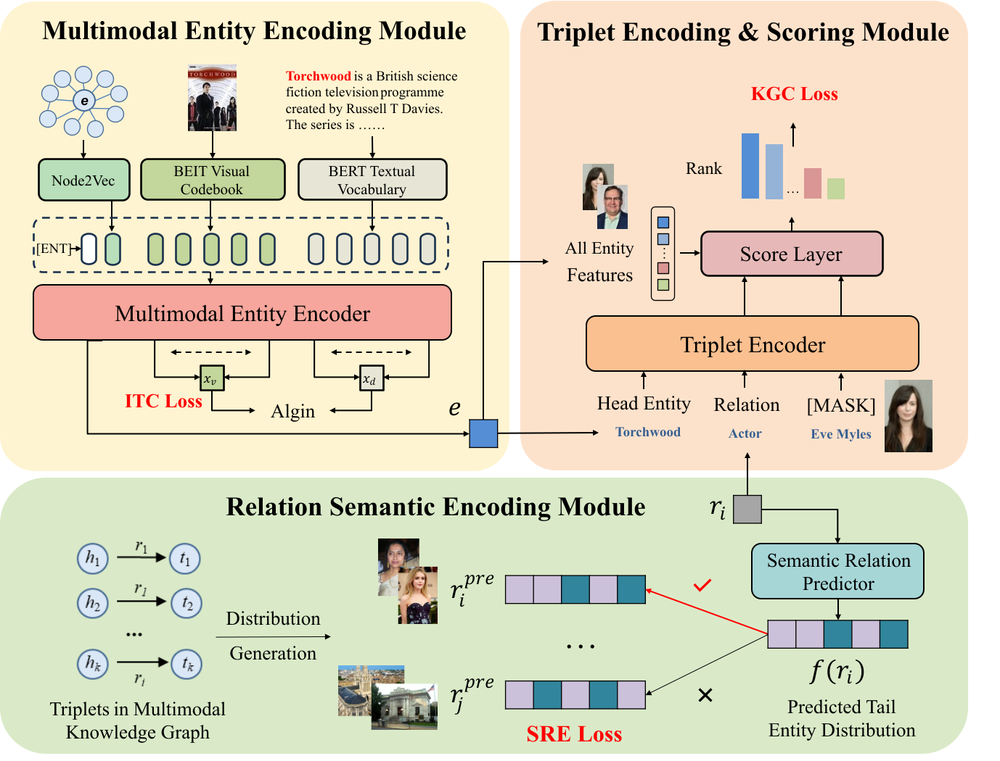

## C2RS: Multimodal Knowledge Graph Completion with Cross-Modal Consistency and Relation Semantics

This is the repository of C<sup>2</sup>RS: Multimodal Knowledge Graph Completion with Cross-Modal Consistency and Relation Semantics



### Requirements:
```shell
numpy==1.24.2
scikit_learn==1.2.2
torch==2.0.0
tqdm==4.64.1
node2vec==0.4.6 
```

### Download:
DB15K and MKG-W: https://github.com/quqxui/MMRNS

### Multimodal Knowledge Graph Completion:
train on DB15K
```shell
sh train_db15k.sh 
```
train on MKG-W
```shell
sh train_mkgw.sh 
```
